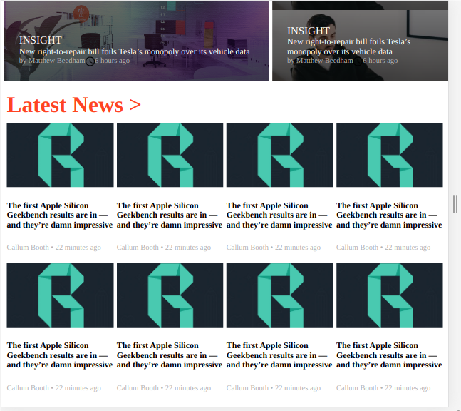

# The-Next-Web-Clone

> This is a Microverse project assignment to build a clone of The Next Web.

Additional description about the project and its features.

## Built With

- HTML
- CSS
- VS-Code

## Live Demo

[Live Demo Link](https://aduda-boaz.github.io/the-nextpage-clone/)

## Authors

👤 **Author1**

- GitHub: [@githubhandle](https://github.com/Aduda-Boaz)
- LinkedIn: [LinkedIn](https://linkedin.com/adudaboaz)

## 🤝 Contributing

Contributions, issues, and feature requests are welcome!

Feel free to check the [issues page](issues/).

## Show your support

Give a ⭐️ if you like this project!

## Acknowledgments

- Hat tip to anyone whose code was used
- Inspiration
- etc

## 📝 License

This project is [MIT](lic.url) licensed.
